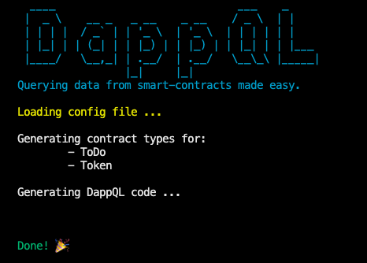
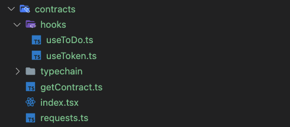

# DappQL

## Querying data from smart-contracts made easy.

## Installation

In your terminal, run:

```bash
npm install -G dappql
```

## Usage

In the root of your project, add a `dapp.config.js` file like the following:

```javascript
module.exports = {
  // The folder containing the abi JSON files for each contract
  abiSourcePath: '../smart-contracts/abis',

  // Where the generate code is going to be located
  targetPath: './contracts',

  // Contract names:
  contracts: {
    ToDo: {
      // Use the network id as a key and the address
      1: 'MAINNET ADDRESSS',
      3: 'ROPSTEN ADDRESSS',
    },
    // Or just the contract address
    Token: 'CONTRACT ADDRESS',
  },
}
```

## Generating the code:

On your application folder, run the command:

```bash
dappql
```

and see the magic happen!

<p align="center"></p>

You'll see the process happening and the code should be in the generated folder.

<p align="center"></p>

## Using it:

Below there's an example of how to make a single query to multiple contracts using the QueryContainer component:

```typescript
import { useEthers } from '@usedapp/core'
import { formatEther } from 'ethers/lib/utils'

import { call, QueryContainer, QueryData } from '../contracts'

const QueryFunction = (account: string) => ({
  bestUserTasksCount: call.ToDo('totalUserTasks', [account]),
  totalTasks: call.ToDo('totalTasks', []),
  openId: call.ToDo('statusCode', ['OPEN']),
  inProgressId: call.ToDo('statusCode', ['IN_PROGRESS']),
  doneId: call.ToDo('statusCode', ['COMPLETE']),
  tokenTotal: call.Token('totalSupply', []),
  tokenName: call.Token('name', []),
  tokenSymbol: call.Token('symbol', []),
  balanceOf: call.Token('balanceOf', [account]),
})

type Props = {
  data: QueryData<ReturnType<typeof QueryFunction>>
}

function TestPage(props: Props) {
  return (
    <div>
      <p>Best User Count: {props.data.bestUserTasksCount.toString()}</p>
      <p>Total Tasks: {props.data.totalTasks.toString()}</p>
      <p>OPEN ID: {props.data.openId}</p>
      <p>IN_PROGRESS ID: {props.data.inProgressId}</p>
      <p>DONE ID: {props.data.doneId}</p>
      <p>Token Total Supply: {formatEther(props.data.tokenTotal)}</p>
      <p>Token Symbol: {props.data.tokenSymbol}</p>
      <p>Token Name: {props.data.tokenName}</p>
      <p>Balance: {formatEther(props.data.balanceOf)}</p>
    </div>
  )
}

export function TestPageQueryContainer({ account }: { account: string }) {
  const query = QueryFunction(account)
  return <QueryContainer query={query} component={TestPage} />
}

export default function Root() {
  const { account } = useEthers()
  if (account) {
    return <TestPageQueryContainer account={account} />
  }

  return null
}
```

All the return types should have typescript types and autocomplete based on the method calls.

## Contributing

Pull requests are welcome. For major changes, please open an issue first to discuss what you would like to change.

## License

[MIT](https://choosealicense.com/licenses/mit/)
